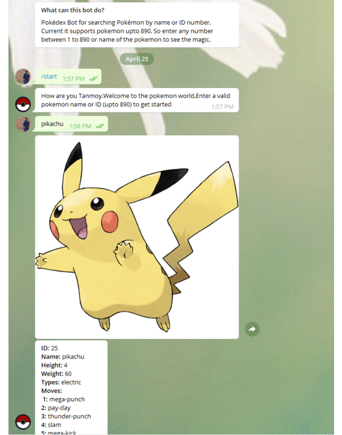

# Pokedex Telegram Bot


### Live Bot Demo<a href="http://t.me/Pokemon_Pokedex_Database_Bot"> Pokedex </a>



## What the bot does?
This is a Pokedex bot that gives information about a particular pokemon when the name or ID of the pokemon is given. Currently, it supports up to 890 pokemon.
## Creating Bot
Go to <a href="https://t.me/botfather" target="_blank">botfather</a> for creating new bot. Copy the API token from there.


## Installation

Use the package manager [pip](https://pip.pypa.io/en/stable/) to install python-telegram-bot and requests.

```bash
pip install python-telegram-bot
pip install requests
```

## Usage

```bash
git clone https://github.com/Tanmoy-Sarkar/Pokedex-Telegram-Bot.git
```

Go to the directory where the folder is located

```bash
python bot.py
```

## License
[MIT](https://choosealicense.com/licenses/mit/)